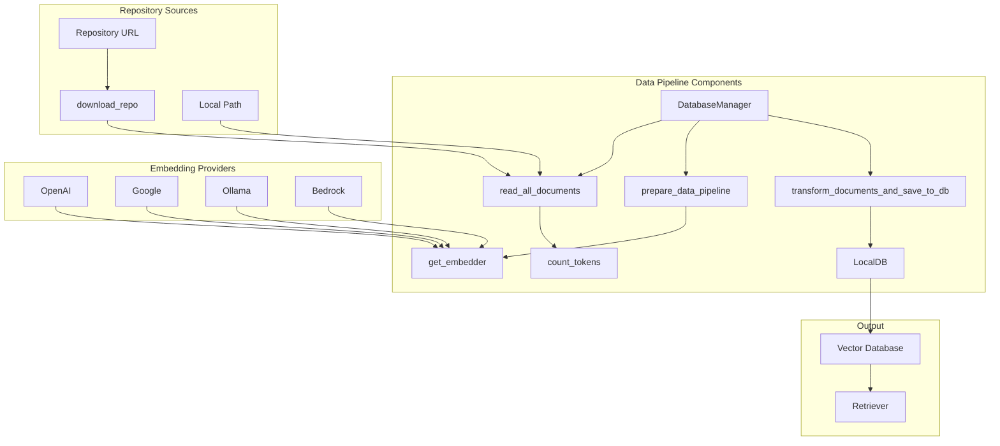
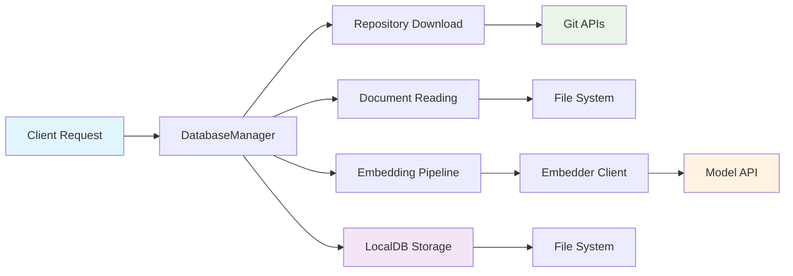
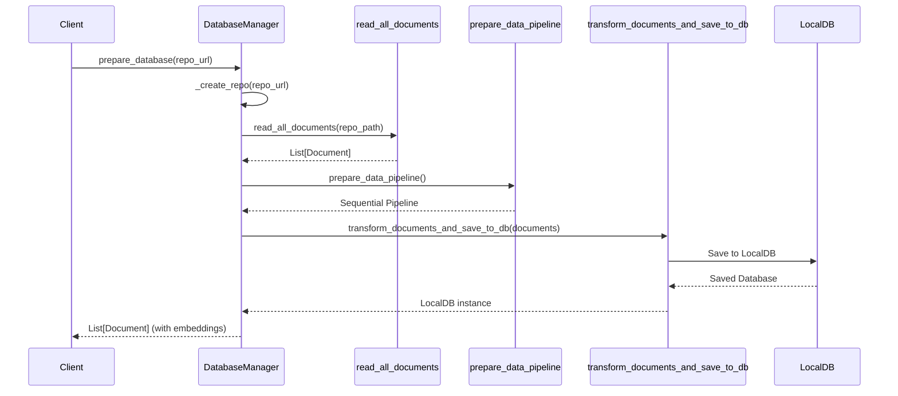
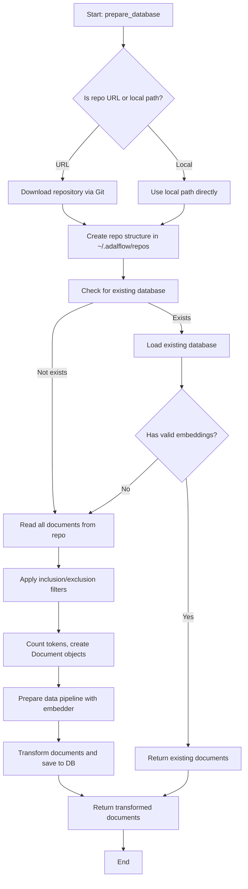
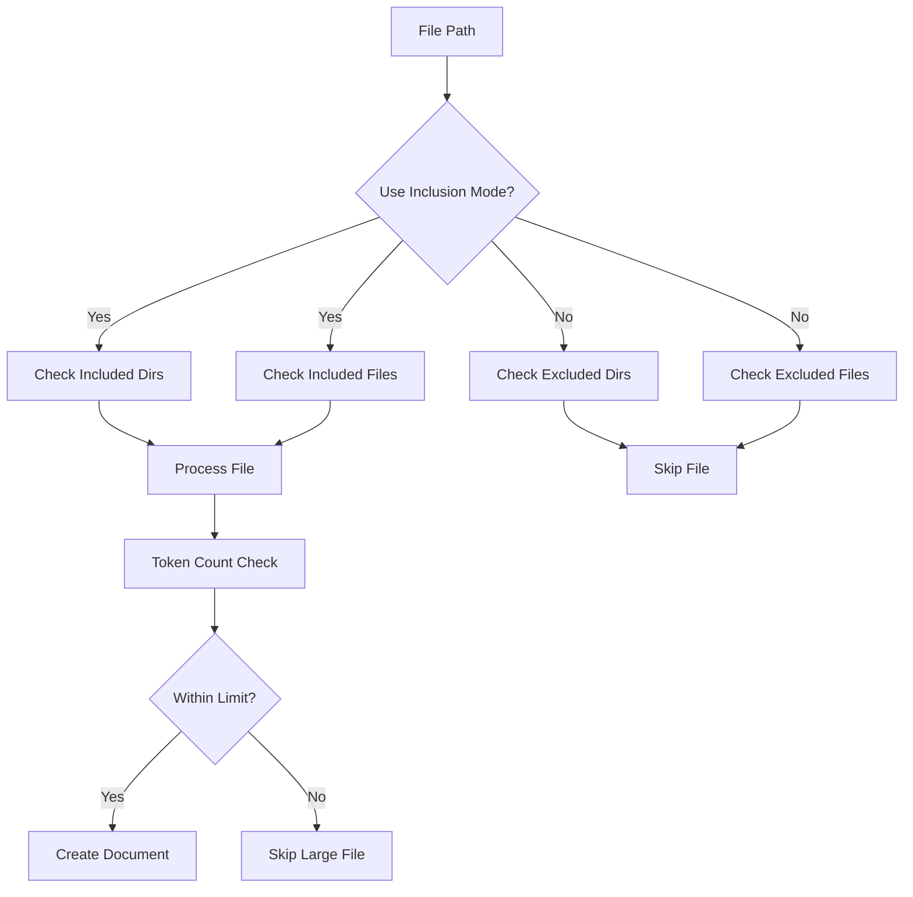

# API Data Pipeline Module Documentation

## Overview

The `api_data_pipeline` module provides a comprehensive data processing pipeline for code repositories. It handles document reading, transformation, embedding, and storage for use in RAG (Retrieval-Augmented Generation) systems. The module supports multiple repository types (GitHub, GitLab, Bitbucket) and various embedding providers (OpenAI, Google, Ollama, Bedrock).

## Architecture



## Core Components

### DatabaseManager

The `DatabaseManager` class is the primary orchestrator of the data pipeline. It manages the complete lifecycle of repository data processing, from initial download to final vector database storage.

**Key Responsibilities:**
- Repository cloning and local storage management
- Document reading and preprocessing
- Database creation and persistence
- Embedding pipeline orchestration

**Methods:**
- `prepare_database()`: Creates a new database from a repository URL or local path
- `prepare_db_index()`: Prepares the indexed database with embeddings
- `prepare_retriever()`: Compatibility method for isolated API usage
- `reset_database()`: Resets the database to initial state
- `_create_repo()`: Internal method to handle repository setup
- `_extract_repo_name_from_url()`: Extracts repository name from URL for unique identification

### read_all_documents

This function recursively reads all documents in a directory, supporting both code files and documentation files. It implements sophisticated filtering capabilities with both inclusion and exclusion modes.

**Supported File Types:**
- Code: `.py`, `.js`, `.ts`, `.java`, `.cpp`, `.c`, `.h`, `.hpp`, `.go`, `.rs`, `.jsx`, `.tsx`, `.html`, `.css`, `.php`, `.swift`, `.cs`
- Documentation: `.md`, `.txt`, `.rst`, `.json`, `.yaml`, `.yml`

**Filtering Modes:**
- **Exclusion Mode**: Uses default exclusions plus custom exclusions (default)
- **Inclusion Mode**: Only processes specified directories and files

**Parameters:**
- `path`: Root directory path to scan
- `embedder_type`: Type of embedder to use for token counting
- `excluded_dirs`: Directories to exclude from processing
- `excluded_files`: File patterns to exclude from processing
- `included_dirs`: Directories to include exclusively
- `included_files`: File patterns to include exclusively

### prepare_data_pipeline

Creates and returns the data transformation pipeline using AdalFlow's sequential processing. The pipeline includes:
1. **TextSplitter**: Splits documents into chunks based on configuration
2. **Embedder**: Converts text chunks to embeddings using the selected provider

The pipeline automatically selects the appropriate embedder based on the configured embedder type.

**Parameters:**
- `embedder_type`: The type of embedder to use ('openai', 'google', 'ollama', 'bedrock')

### transform_documents_and_save_to_db

Transforms a list of documents through the data pipeline and saves the results to a local database. This function handles the complete transformation process from raw documents to embedded vectors.

**Parameters:**
- `documents`: List of Document objects to transform
- `db_path`: Path to save the database file
- `embedder_type`: Type of embedder to use

### count_tokens

Counts the number of tokens in a text string using tiktoken, with different encodings based on the embedder type.

**Parameters:**
- `text`: Text to count tokens for
- `embedder_type`: Type of embedder ('openai', 'google', 'ollama', 'bedrock')

### Repository Download Functions

The module includes several functions for downloading repositories from different Git hosting services:

- `download_repo`: Main function for downloading repositories with support for GitHub, GitLab, and Bitbucket
- `download_github_repo`: Alias for backward compatibility
- `get_file_content`: Retrieves individual file content from repositories
- `get_github_file_content`: Gets file content from GitHub repositories
- `get_gitlab_file_content`: Gets file content from GitLab repositories
- `get_bitbucket_file_content`: Gets file content from Bitbucket repositories

## Component Interactions



## Data Flow



## Process Flow



## Repository Support

The module provides comprehensive support for multiple Git repository hosting services:

### Repository Download
- **GitHub**: Supports both public and enterprise GitHub instances
- **GitLab**: Supports cloud and self-hosted GitLab instances
- **Bitbucket**: Supports Bitbucket Cloud

### Authentication
- Personal Access Tokens for private repositories
- URL-based token injection with proper sanitization
- Support for different authentication schemes per platform

### File Content Retrieval
- Direct API access for individual files
- Branch detection and handling
- Proper error handling and response parsing

## Embedding Support

The module supports multiple embedding providers with automatic selection based on configuration:

### OpenAI Embeddings
- Uses `text-embedding-3-small` model by default
- Batch processing for efficiency
- Token counting with tiktoken

### Google Embeddings
- Compatible tokenization for estimation
- Batch processing support

### Ollama Embeddings
- Single-document processing approach
- Uses `cl100k_base` encoding for token estimation
- Local processing capabilities

### Bedrock Embeddings
- AWS Bedrock integration
- Compatible tokenization for estimation

## Configuration and Filtering

### File Filtering
The module provides flexible file filtering capabilities:



### Default Exclusions
- Common build directories, test directories, and binary files
- Configurable through `DEFAULT_EXCLUDED_DIRS` and `DEFAULT_EXCLUDED_FILES`

## Dependencies

This module depends on several other modules in the system:

- **[api_rag](api_rag.md)**: Provides RAG capabilities that consume the processed data
- **[api_model_clients](api_model_clients.md)**: Provides embedding clients used by the pipeline
- **[api_endpoints](api_endpoints.md)**: Provides API endpoints that utilize the data pipeline
- **[frontend_components](frontend_components.md)**: Provides UI components that interact with the pipeline
- **[api.config](api_config.md)**: Provides configuration settings for embedders, file filters, and text splitter parameters
- **[api.tools.embedder](api_model_clients.md)**: Provides embedder utilities
- **[api.ollama_patch](api_model_clients.md)**: Provides special handling for Ollama document processing

## Token Management

The module includes sophisticated token counting capabilities:

- **OpenAI Models**: Uses appropriate tiktoken encodings
- **Ollama Models**: Uses `cl100k_base` encoding
- **Google Models**: Uses GPT-like encoding for estimation
- **Fallback**: Simple character-based approximation

## Error Handling and Security

The module implements comprehensive error handling and security measures:

### Error Handling
- Repository download failures with token sanitization
- File reading errors with detailed logging
- Embedding processing failures
- Database persistence errors
- Token counting fallbacks for when tiktoken fails

### Security Considerations
- Access token sanitization in error messages to prevent exposure
- URL encoding of tokens for proper authentication
- Input validation for repository URLs and file paths
- Protection against path traversal attacks

### Token Sanitization
The module ensures that access tokens are never exposed in error messages or logs by sanitizing them in both raw and URL-encoded forms.

## Usage Examples

### Basic Repository Processing
```python
db_manager = DatabaseManager()
documents = db_manager.prepare_database("https://github.com/user/repo")
```

### Custom Filtering
```python
documents = db_manager.prepare_database(
    "https://github.com/user/repo",
    included_dirs=["src", "lib"],
    excluded_files=["test_*.py", "*.tmp"]
)
```

### Private Repository Access
```python
documents = db_manager.prepare_database(
    "https://github.com/user/private-repo",
    access_token="your_token_here"
)
```

## Performance Considerations

- **Batch Processing**: OpenAI and Google embedders use batch processing for efficiency
- **Token Limits**: Automatic filtering of files exceeding token limits (8192 tokens for embeddings, 81920 for code files)
- **Caching**: Existing databases are loaded instead of reprocessing
- **Parallel Processing**: AdalFlow's sequential processing optimizes pipeline execution
- **Repository Cloning**: Uses `--depth=1` for shallow clones to reduce download time
- **File Filtering**: Efficient glob patterns for file discovery
- **Memory Management**: Processes large repositories in chunks to avoid memory issues

## Integration Points

The data pipeline integrates with the broader system through:

1. **Configuration System**: Uses centralized configuration for embedder settings
2. **Logging System**: Comprehensive logging for debugging and monitoring
3. **Database Layer**: Uses AdalFlow's LocalDB for persistence
4. **API Layer**: Provides data for RAG and chat endpoints
5. **Embedder Clients**: Integrates with various model clients through the embedder interface
6. **File System**: Stores processed repositories and databases in `~/.adalflow` directory

## File Structure

The module creates the following file structure in the user's home directory:

```
~/.adalflow/
├── repos/
│   └── {owner}_{repo_name}/     # Cloned repositories
└── databases/
    └── {owner}_{repo_name}.pkl  # Processed vector databases
```

## Backward Compatibility

The module maintains backward compatibility through:
- `is_ollama_embedder` parameter (deprecated, use `embedder_type` instead)
- `download_github_repo` alias for `download_repo`
- Support for old configuration formats

This module serves as the foundational data processing layer that enables the entire RAG system to function effectively.