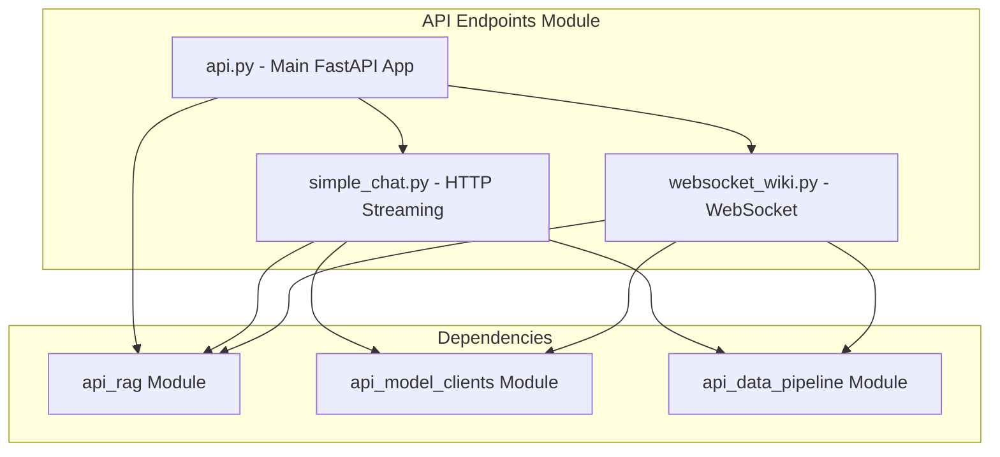
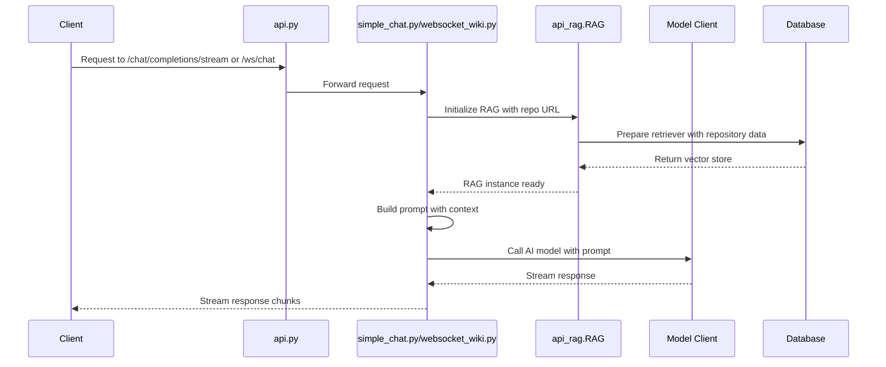

# API Endpoints Module Documentation

## Overview

The `api_endpoints` module serves as the primary interface layer for the DeepWiki application, providing REST API endpoints and WebSocket connections for chat completions, repository analysis, and wiki management. This module integrates with various AI model providers and implements Retrieval-Augmented Generation (RAG) capabilities for code repository analysis.

## Architecture

The module is composed of three main components:

- **api.py**: Main FastAPI application with core endpoints
- **simple_chat.py**: HTTP streaming chat completion endpoint
- **websocket_wiki.py**: WebSocket-based chat completion endpoint



## Core Components

### 1. api.py - Main API Application

The main FastAPI application that provides various endpoints for:

- **Model Configuration**: `/models/config` - Returns available AI model providers and their configurations
- **Wiki Export**: `/export/wiki` - Exports wiki content in Markdown or JSON format
- **Local Repository Structure**: `/local_repo/structure` - Returns file tree and README content for local repositories
- **Wiki Cache Management**: 
  - `GET /api/wiki_cache` - Retrieves cached wiki data
  - `POST /api/wiki_cache` - Stores wiki data to cache
  - `DELETE /api/wiki_cache` - Deletes specific wiki cache
- **Processed Projects**: `/api/processed_projects` - Lists all processed projects from cache directory
- **Health Check**: `/health` - Health check endpoint for monitoring
- **Root Endpoint**: `/` - Lists all available endpoints

### 2. simple_chat.py - HTTP Streaming Chat

Provides the `/chat/completions/stream` endpoint that implements streaming chat completions with:

- Multi-provider AI model support (Google, OpenAI, OpenRouter, Ollama, AWS Bedrock, Azure, Dashscope)
- RAG-based repository analysis
- Deep Research functionality for multi-iteration analysis
- Conversation history management
- File-specific context retrieval
- Token limit handling with fallback mechanisms

### 3. websocket_wiki.py - WebSocket Chat

Provides WebSocket-based chat functionality through the `/ws/chat` endpoint with:

- Real-time bidirectional communication
- Same AI model provider support as HTTP streaming
- RAG-based repository analysis
- Deep Research functionality
- Error handling and fallback mechanisms

## Data Flow



## Key Features

### Multi-Provider AI Support
The module supports multiple AI model providers through a unified interface:
- Google (default)
- OpenAI
- OpenRouter
- Ollama (local)
- AWS Bedrock
- Azure AI
- Dashscope

### RAG Implementation
Integrates with the [api_rag](api_rag.md) module to provide:
- Repository content retrieval
- Document embedding and similarity search
- Context-aware responses
- File-specific analysis

### Deep Research Functionality
- Multi-iteration research process for complex queries
- Maintains research context across iterations
- Supports up to 5 research iterations
- Provides structured research plans and conclusions

### Caching System
- Server-side wiki cache management
- File-based cache storage
- Language-specific caching
- Authorization for cache deletion

### Authentication & Authorization
- Configurable authentication for wiki operations
- Authorization codes for cache management
- Token support for private repositories

## API Endpoints

### Model Configuration
```
GET /models/config
```
Returns available model providers and their configurations.

### Chat Completions (HTTP Streaming)
```
POST /chat/completions/stream
```
Streams chat completions with repository context.

### WebSocket Chat
```
WebSocket /ws/chat
```
Real-time chat with repository context.

### Wiki Export
```
POST /export/wiki
```
Exports wiki content in Markdown or JSON format.

### Local Repository Structure
```
GET /local_repo/structure
```
Returns file tree and README content for local repositories.

### Wiki Cache Management
```
GET    /api/wiki_cache
POST   /api/wiki_cache
DELETE /api/wiki_cache
```
Manages cached wiki data.

### Processed Projects
```
GET /api/processed_projects
```
Lists all processed projects from cache directory.

### Health Check
```
GET /health
```
Health check endpoint for monitoring.

## Error Handling

The module implements comprehensive error handling:
- Token limit detection and fallback responses
- Provider-specific error messages
- Graceful degradation when RAG fails
- WebSocket disconnection handling
- Validation for all input parameters

## Integration Points

The `api_endpoints` module integrates with:
- [api_rag](api_rag.md) for retrieval-augmented generation
- [api_model_clients](api_model_clients.md) for AI model interactions
- [api_data_pipeline](api_data_pipeline.md) for data processing and retrieval
- Frontend components for real-time communication

## Configuration

The module uses the `api.config` module for:
- Model provider settings
- API keys for various services
- Language configuration
- Authentication settings
- Default provider selection

## Security Considerations

- CORS configured to allow all origins (should be restricted in production)
- Optional authentication for wiki cache operations
- Token support for private repositories
- Input validation for all endpoints