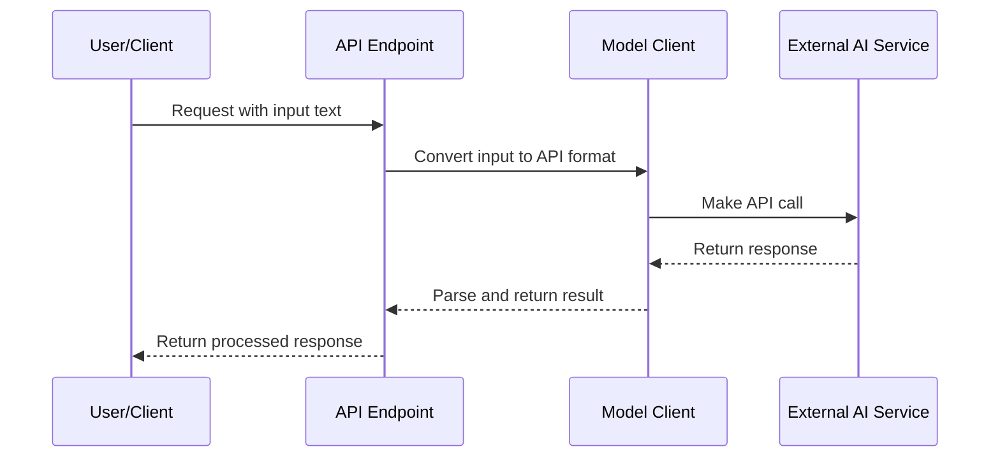

# API Model Clients Module Documentation

The `api_model_clients` module provides a comprehensive set of client wrappers for various AI model providers, enabling seamless integration with different LLM and embedding services. This module serves as a bridge between the application and external AI services, abstracting the complexity of different API formats and authentication mechanisms.

## Architecture Overview

```mermaid
graph TB
    subgraph "API Model Clients Module"
        OpenAIClient[OpenAI Client]
        AzureAIClient[Azure AI Client]
        OpenRouterClient[OpenRouter Client]
        BedrockClient[Bedrock Client]
        DashscopeClient[Dashscope Client]
        GoogleEmbedderClient[Google Embedder Client]
        OllamaPatch[Ollama Document Processor]
    end

    subgraph "Core Components"
        ModelClient[Base ModelClient]
        Generator[Generator Component]
        Embedder[Embedder Component]
    end

    subgraph "External Services"
        OpenAI[OpenAI API]
        AzureOpenAI[Azure OpenAI]
        OpenRouter[OpenRouter API]
        AWSBedrock[AWS Bedrock]
        AlibabaCloud[Alibaba Cloud]
        GoogleAI[Google AI]
        Ollama[Ollama]
    end

    OpenAIClient --> ModelClient
    AzureAIClient --> ModelClient
    OpenRouterClient --> ModelClient
    BedrockClient --> ModelClient
    DashscopeClient --> ModelClient
    GoogleEmbedderClient --> ModelClient

    Generator --> OpenAIClient
    Generator --> AzureAIClient
    Generator --> OpenRouterClient
    Generator --> BedrockClient
    Generator --> DashscopeClient
    Generator --> GoogleEmbedderClient

    Embedder --> OpenAIClient
    Embedder --> AzureAIClient
    Embedder --> OpenRouterClient
    Embedder --> BedrockClient
    Embedder --> DashscopeClient
    Embedder --> GoogleEmbedderClient

    OpenAIClient --> OpenAI
    AzureAIClient --> AzureOpenAI
    OpenRouterClient --> OpenRouter
    BedrockClient --> AWSBedrock
    DashscopeClient --> AlibabaCloud
    GoogleEmbedderClient --> GoogleAI
    OllamaPatch --> Ollama
```

## Module Components

### OpenAI Client
The OpenAI Client provides integration with OpenAI's API services, supporting both chat completion and embedding capabilities. It includes multimodal support for vision models and image generation capabilities.

For detailed information about the OpenAI Client, see [OpenAI Client Documentation](openai_client.md).

### Azure AI Client
The Azure AI Client enables integration with Azure OpenAI services, supporting both API key and Azure AD token authentication methods. It provides similar functionality to the OpenAI client but with Azure-specific configurations.

For detailed information about the Azure AI Client, see [Azure AI Client Documentation](azureai_client.md).

### OpenRouter Client
The OpenRouter Client provides access to hundreds of AI models through a unified API endpoint. It's compatible with OpenAI's API format with some differences and serves as a unified interface to multiple model providers.

For detailed information about the OpenRouter Client, see [OpenRouter Client Documentation](openrouter_client.md).

### Bedrock Client
The AWS Bedrock Client provides access to various foundation models including Amazon's own models and third-party models like Anthropic Claude. It supports both LLM and embedding operations.

For detailed information about the Bedrock Client, see [Bedrock Client Documentation](bedrock_client.md).

### Dashscope Client
The Dashscope Client integrates with Alibaba Cloud's Qwen and other models through an OpenAI-compatible API. It includes specialized batch embedding capabilities and document processing components.

For detailed information about the Dashscope Client, see [Dashscope Client Documentation](dashscope_client.md).

### Google Embedder Client
The Google Embedder Client provides access to Google's embedding models through the Google AI API, specifically designed for text embeddings and semantic similarity tasks.

For detailed information about the Google Embedder Client, see [Google Embedder Client Documentation](google_embedder_client.md).

### Ollama Document Processor
The Ollama Document Processor handles document processing for Ollama embeddings, addressing the limitation that Adalflow's Ollama Client doesn't support batch embedding by processing documents individually.

For detailed information about the Ollama Document Processor, see [Ollama Document Processor Documentation](ollama_patch.md).

## Integration with Other Modules

The API Model Clients module integrates with other modules in the system:

- **[api_rag.md](api_rag.md)**: Provides model clients for RAG operations
- **[api_data_pipeline.md](api_data_pipeline.md)**: Uses model clients for data processing and transformation
- **[api_endpoints.md](api_endpoints.md)**: Supplies model clients to API endpoints for AI operations

## Data Flow

## Configuration and Authentication

Each client supports different authentication methods:

- **Environment Variables**: Most clients support configuration through environment variables
- **API Keys**: Direct API key configuration
- **Token-based**: Azure AD token authentication
- **AWS Credentials**: IAM-based authentication for Bedrock
- **Workspace IDs**: For Dashscope and other services

## Error Handling and Retry Logic

The module implements robust error handling and retry mechanisms using backoff strategies for handling API timeouts, rate limits, and server errors. Each client includes specific error handling for provider-specific issues.

## Performance Considerations

- **Batch Processing**: Some clients support batch operations for improved performance
- **Caching**: Embedding results can be cached to avoid repeated API calls
- **Streaming**: LLM responses support streaming for real-time processing
- **Async Support**: All clients provide both synchronous and asynchronous interfaces