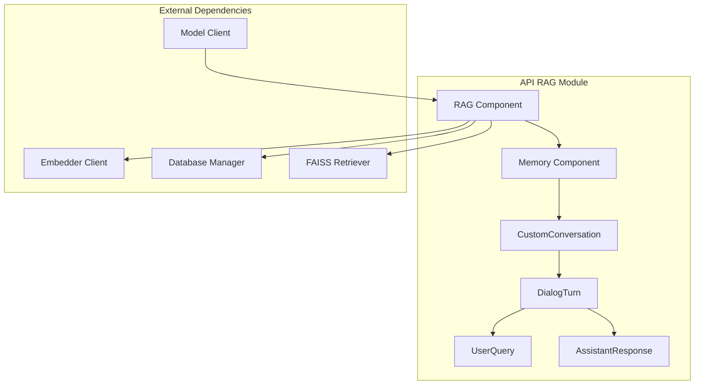
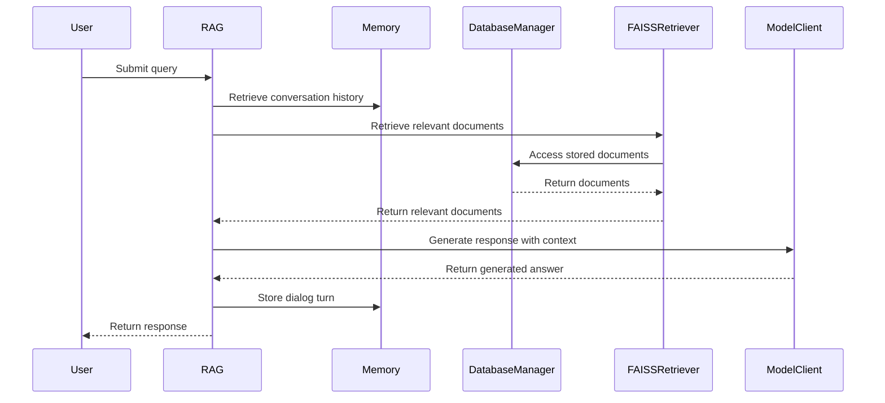
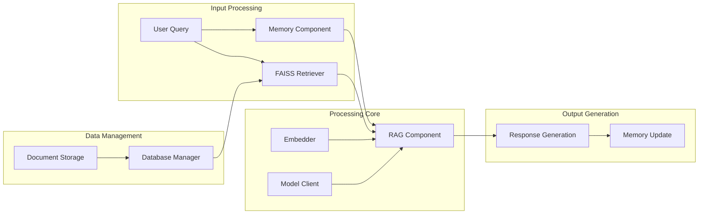
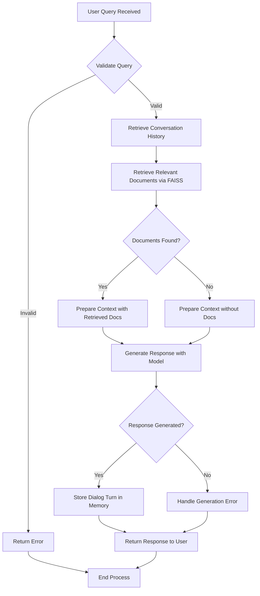

# API RAG Module Documentation

## Overview

The `api_rag` module provides a comprehensive Retrieval-Augmented Generation (RAG) system that combines document retrieval with language model generation to answer user queries. This module implements a conversational interface with memory management, document retrieval capabilities, and integration with various AI model providers.

The module is built on top of the AdalFlow framework and includes custom implementations for conversation management, memory storage, and document processing to ensure robust performance and error handling.

## Architecture

## Core Components

### RAG Component

The `RAG` class is the main component that orchestrates the entire RAG process. It manages document retrieval, conversation memory, and response generation.

**Key Features:**
- Supports multiple model providers (Google, OpenAI, OpenRouter, Ollama)
- Integrates with FAISS for efficient document retrieval
- Manages conversation history through the Memory component
- Handles embedding validation and filtering
- Provides error recovery mechanisms

**Initialization Parameters:**
- `provider`: Model provider to use (default: "google")
- `model`: Specific model name for the provider
- `use_s3`: Whether to use S3 for database storage (default: False)

### Memory Component

The `Memory` class manages conversation history and provides a safe interface for storing and retrieving dialog turns.

**Key Features:**
- Uses a custom conversation implementation to avoid index out-of-range errors
- Provides safe access to conversation history
- Implements error recovery mechanisms
- Maintains dialog turn integrity

### Custom Conversation Classes

The module includes several custom data classes for managing conversation state:

- **UserQuery**: Stores user query strings
- **AssistantResponse**: Stores assistant response strings  
- **DialogTurn**: Represents a complete conversation turn with ID, user query, and assistant response
- **CustomConversation**: Custom implementation of conversation management with safe append operations

### RAGAnswer Data Class

The `RAGAnswer` data class defines the structure for RAG responses with:
- `rationale`: Chain of thoughts for the answer
- `answer`: Final answer formatted in markdown

## Data Flow

## Component Interactions

## Process Flow

## Key Methods

### RAG.prepare_retriever()
Prepares the retriever for a repository by:
1. Initializing the database manager
2. Loading documents from the repository
3. Validating and filtering embeddings
4. Creating the FAISS retriever

### RAG.call()
Processes a query using RAG by:
1. Retrieving relevant documents
2. Generating a response with context
3. Returning the answer and retrieved documents

### Memory.add_dialog_turn()
Safely adds a dialog turn to the conversation history with error recovery mechanisms.

## Error Handling

The module implements comprehensive error handling mechanisms:

- **Embedding Validation**: The `_validate_and_filter_embeddings` method ensures all documents have consistent embedding sizes
- **Conversation Recovery**: Memory component includes try-catch blocks with recovery mechanisms for conversation management
- **Model Availability**: Checks for Ollama model availability before initialization
- **Database Fallback**: Loads from local storage when available
- **Query Embedder Patch**: Special handling for Ollama embedder to ensure single string input

## Integration Points

This module integrates with:
- [api_data_pipeline.md](api_data_pipeline.md) for database management and document processing
- [api_model_clients.md](api_model_clients.md) for various AI model providers
- [api_endpoints.md](api_endpoints.md) for API endpoints
- [frontend_components.md](frontend_components.md) for user interface components

## Configuration

The module uses configuration from [api_config.md](api_config.md) to determine:
- Model provider settings
- Embedder configuration
- Database storage options
- Retrieval parameters

## Performance Considerations

- Implements embedding validation to ensure consistent vector sizes
- Uses weak references to prevent memory leaks
- Implements token limits for embedding models (MAX_INPUT_TOKENS = 7500)
- Provides efficient document retrieval through FAISS

## Security Considerations

- Supports access tokens for private repositories
- Implements proper error handling to prevent information leakage
- Validates input parameters before processing