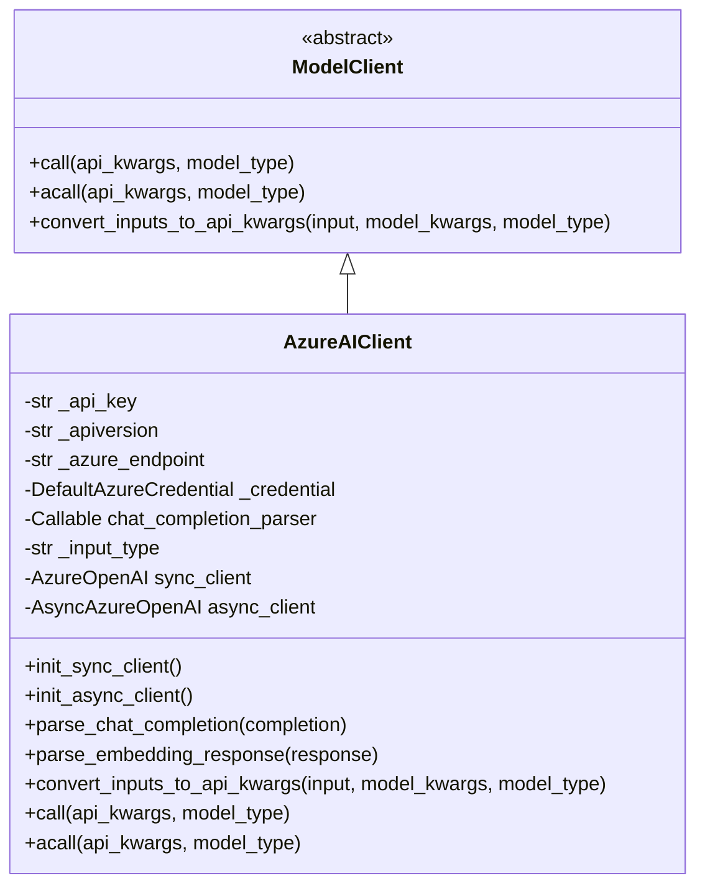
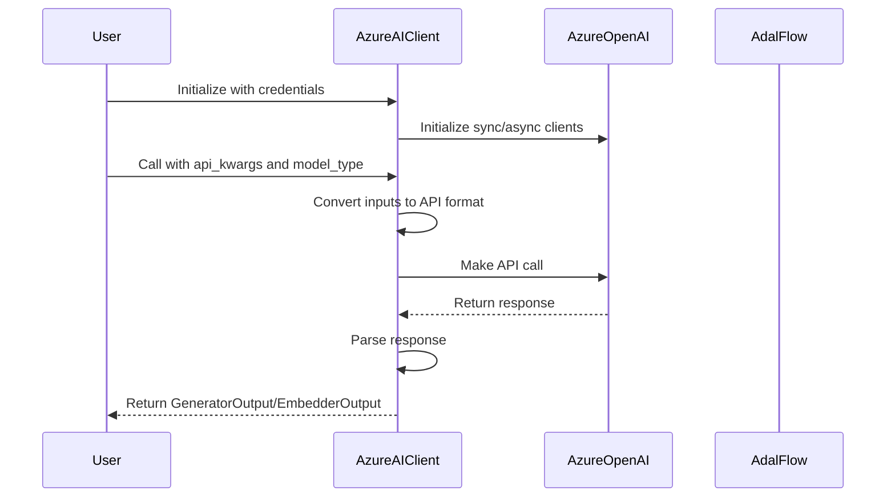
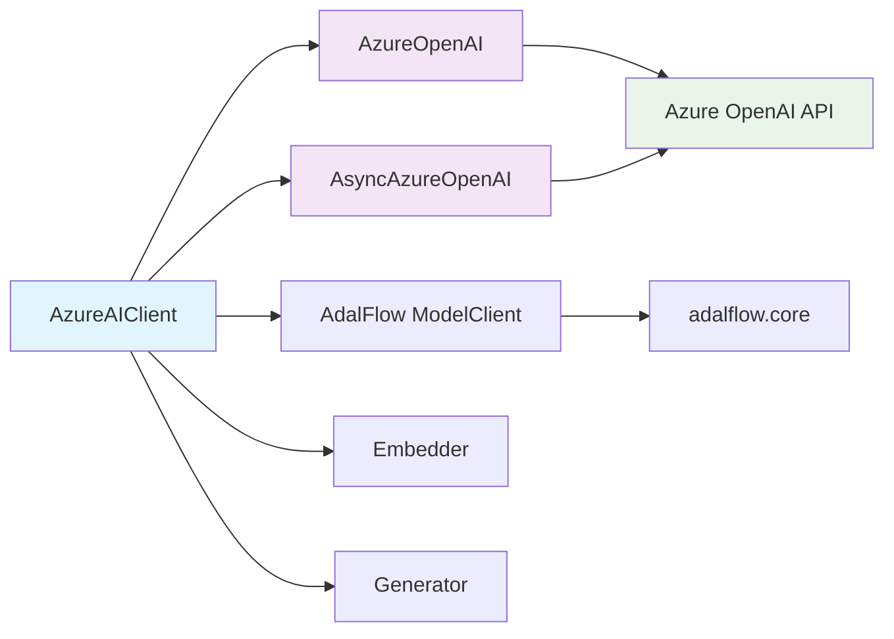

# AzureAIClient Module Documentation

## Overview

The `AzureAIClient` module provides a client wrapper for interacting with Azure OpenAI's API. It extends the `ModelClient` base class from the AdalFlow framework and offers support for both embedding and chat completion API calls. This module allows users to simplify their interactions with Azure OpenAI models through the `Embedder` and `Generator` components.

The module supports two authentication methods:
- API Key authentication
- Azure Active Directory (AAD) token authentication

## Architecture



## Core Components

### AzureAIClient

The main class that implements the Azure OpenAI client functionality. It inherits from `ModelClient` and provides the following key features:

- **Authentication Support**: Supports both API key and Azure AD token authentication
- **API Type**: Set to "azure" for identification
- **Synchronous and Asynchronous Clients**: Maintains both sync and async client instances
- **Chat Completion Parsing**: Configurable parser for handling chat completion responses
- **Input Type Handling**: Supports both "text" and "messages" input formats

## Dependencies

The `AzureAIClient` module depends on several external packages:

- `azure.identity` for Azure AD authentication
- `openai` for Azure OpenAI API interactions
- `adalflow` for the base `ModelClient` class and core types
- `backoff` for retry logic on API failures

The module also integrates with the [model_clients](api_model_clients.md) architecture and works with [rag](api_rag.md) components for embedding and generation tasks.

## Data Flow



## Component Interactions



## Key Functions

### Authentication Setup
- `init_sync_client()`: Initializes the synchronous Azure OpenAI client
- `init_async_client()`: Initializes the asynchronous Azure OpenAI client

### Response Parsing
- `parse_chat_completion()`: Parses chat completion responses
- `parse_embedding_response()`: Parses embedding responses
- `track_completion_usage()`: Tracks token usage from API responses

### Input Conversion
- `convert_inputs_to_api_kwargs()`: Converts standard inputs to API-specific format

### API Calls
- `call()`: Synchronous API call with retry logic
- `acall()`: Asynchronous API call with retry logic

## Configuration

The `AzureAIClient` can be configured through:

1. **Constructor Parameters**:
   - `api_key`: Azure OpenAI API key
   - `api_version`: API version to use
   - `azure_endpoint`: Azure OpenAI endpoint URL
   - `credential`: Azure AD credential for token-based authentication
   - `chat_completion_parser`: Function to parse chat completions
   - `input_type`: Format for input ("text" or "messages")

2. **Environment Variables**:
   - `AZURE_OPENAI_API_KEY`: Azure OpenAI API key
   - `AZURE_OPENAI_ENDPOINT`: Azure OpenAI endpoint
   - `AZURE_OPENAI_VERSION`: API version

## Usage Examples

### Basic Initialization
```python
from azure.identity import DefaultAzureCredential
from api.azureai_client import AzureAIClient

# Initialize with API key
client = AzureAIClient(
    api_key="your_api_key",
    api_version="2023-05-15",
    azure_endpoint="https://your-endpoint.openai.azure.com/"
)

# Or initialize with Azure AD token
client = AzureAIClient(
    api_version="2023-05-15",
    azure_endpoint="https://your-endpoint.openai.azure.com/",
    credential=DefaultAzureCredential()
)
```

### Chat Completion Call
```python
api_kwargs = {
    "model": "gpt-3.5-turbo",
    "messages": [{"role": "user", "content": "What is the meaning of life?"}],
    "stream": True
}
response = client.call(api_kwargs=api_kwargs, model_type=ModelType.LLM)

for chunk in response:
    print(chunk)
```

## Error Handling

The module implements comprehensive error handling with:

- **Retry Logic**: Uses `backoff` for automatic retries on API failures
- **Exception Types**: Handles `APITimeoutError`, `InternalServerError`, `RateLimitError`, `UnprocessableEntityError`, and `BadRequestError`
- **Graceful Degradation**: Provides error messages in output when parsing fails

## Integration Points

The `AzureAIClient` integrates with:

- [api_model_clients](api_model_clients.md) for model client management
- [api_rag](api_rag.md) for embedding and retrieval-augmented generation
- [api_data_pipeline](api_data_pipeline.md) for data processing workflows
- [api_endpoints](api_endpoints.md) for API endpoint integration

## Best Practices

1. **Authentication**: Use environment variables for sensitive data like API keys
2. **Error Handling**: Implement proper error handling for API calls
3. **Resource Management**: Properly manage client lifecycle and connections
4. **Configuration**: Use appropriate API versions and endpoints for your Azure region

## References

- [Azure OpenAI API Documentation](https://learn.microsoft.com/en-us/azure/ai-services/openai/overview)
- [OpenAI API Documentation](https://platform.openai.com/docs/guides/text-generation)
- [adalflow documentation](https://github.com/your-repo/adalflow)
- [Azure Identity Documentation](https://docs.microsoft.com/en-us/python/api/azure-identity/)