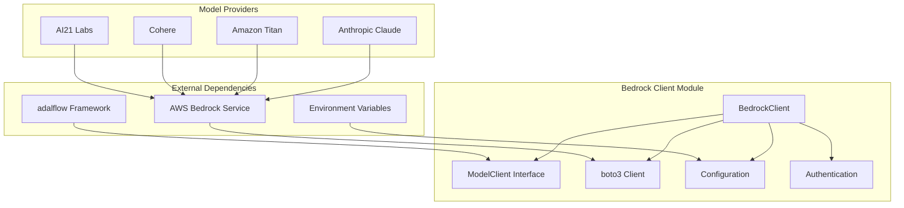
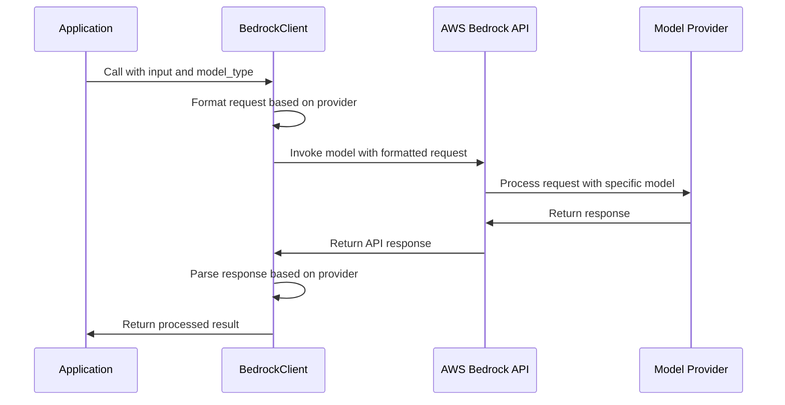
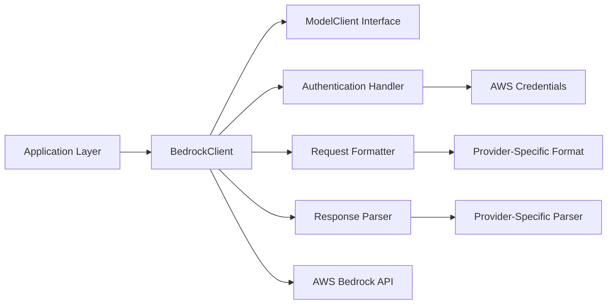

# Bedrock Client Module Documentation

## Overview

The `bedrock_client` module provides integration with AWS Bedrock, a managed service that offers access to various foundation models from Amazon and third-party providers like Anthropic, Cohere, AI21 Labs, and others. This module implements the `ModelClient` interface from the adalflow framework to enable seamless integration with AWS Bedrock's model APIs for both language models (LLMs) and embedding models.

The module handles authentication, request formatting, response parsing, and error handling for different model providers available through AWS Bedrock.

## Architecture



## Core Components

### BedrockClient Class

The `BedrockClient` class is the primary component of this module, extending the `ModelClient` interface from the adalflow framework.

#### Key Features:
- **Multi-provider Support**: Handles different model providers (Anthropic, Amazon, Cohere, AI21)
- **Authentication Management**: Supports various AWS authentication methods including IAM roles
- **Request Formatting**: Adapts requests to provider-specific formats
- **Response Parsing**: Extracts results according to provider specifications
- **Embedding Support**: Handles both LLM and embedding model types
- **Async/Sync Operations**: Provides both synchronous and asynchronous interfaces

#### Configuration Parameters:
- `aws_access_key_id`: AWS access key ID
- `aws_secret_access_key`: AWS secret access key
- `aws_session_token`: AWS session token (optional)
- `aws_region`: AWS region (defaults to us-east-1)
- `aws_role_arn`: AWS IAM role ARN for role-based authentication

## Dependencies

The `bedrock_client` module depends on several other modules and external libraries:

- **adalflow**: Core framework providing the `ModelClient` interface and model types
- **api.config**: Configuration module containing AWS credentials and settings
- **api.logging_config**: Logging configuration for the module
- **boto3**: AWS SDK for Python used to interact with AWS services
- **botocore**: AWS SDK core library providing error handling and retry logic

## Data Flow



## Component Interactions



## Process Flow

### LLM Request Process
1. **Input Conversion**: Application input is converted to API kwargs via `convert_inputs_to_api_kwargs`
2. **Provider Detection**: Model ID is parsed to determine the provider (e.g., "anthropic.claude-3-sonnet-20240229-v1:0" → "anthropic")
3. **Request Formatting**: Input is formatted according to provider specifications
4. **API Call**: Request is sent to AWS Bedrock API using boto3 client
5. **Response Parsing**: Response is parsed according to provider format
6. **Result Return**: Processed result is returned to the application

### Embedding Request Process
1. **Input Validation**: Input is validated and converted to list format if needed
2. **Provider Detection**: Model ID is parsed to determine the provider
3. **Batch Handling**: Different providers have different batch processing capabilities
4. **API Call**: Embedding request is sent to AWS Bedrock API
5. **Response Processing**: Embeddings are extracted and formatted as `EmbedderOutput`
6. **Result Return**: Processed embeddings are returned to the application

## Error Handling

The module implements comprehensive error handling:

- **Authentication Errors**: Proper handling of credential issues
- **API Errors**: Retry logic using backoff for transient failures
- **Provider-Specific Errors**: Different error formats for different providers
- **Serialization Errors**: Proper handling of client state during serialization/deserialization

## Configuration

The module can be configured through:

1. **Constructor Parameters**: Direct parameter passing during initialization
2. **Environment Variables**: Fallback to environment variables for AWS credentials
3. **Configuration Module**: Default values from `api.config` module

## Integration with Other Modules

The `bedrock_client` module integrates with other modules in the system:

- **api.model_clients**: Part of the model client family alongside [openai_client.md], [azureai_client.md], [openrouter_client.md], etc.
- **api.rag**: Used by the RAG system for model inference operations
- **api.data_pipeline**: May be used for processing documents with LLMs during data preparation

## Usage Examples

```python
from api.bedrock_client import BedrockClient

# Initialize the client
client = BedrockClient()

# Use with adalflow Generator
generator = adal.Generator(
    model_client=client,
    model_kwargs={"model": "anthropic.claude-3-sonnet-20240229-v1:0"}
)
```

## Security Considerations

- **Credential Management**: Supports IAM roles and temporary credentials
- **Serialization Safety**: Proper handling of non-picklable client objects
- **Environment Isolation**: Separates configuration from code

## Performance Considerations

- **Client Reuse**: Initializes clients once and reuses them
- **Lazy Initialization**: Async client is initialized only when needed
- **Batch Processing**: Optimizes embedding requests based on provider capabilities