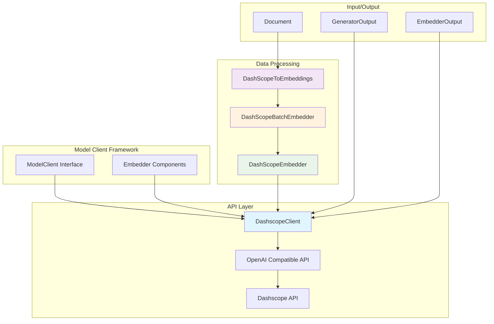
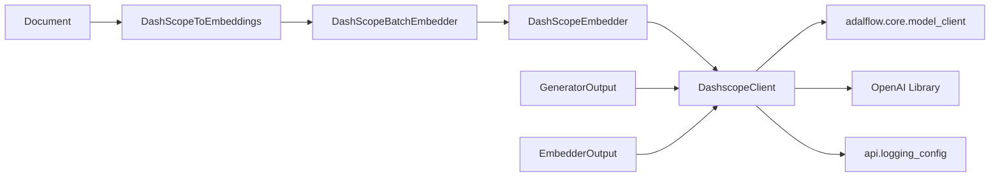
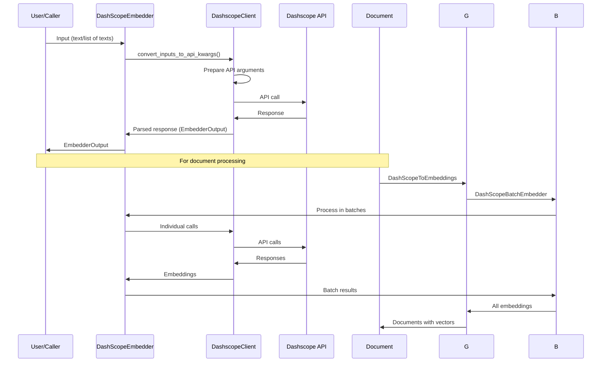

# Dashscope Client Module Documentation

## Introduction

The `dashscope_client` module provides integration with Alibaba Cloud's Dashscope API, offering access to Qwen and other models through an OpenAI-compatible interface. This module implements the `ModelClient` interface from the adalflow framework and provides both LLM and embedding capabilities for Dashscope models.

## Architecture Overview

The Dashscope client module follows a layered architecture that integrates with the broader model client ecosystem:



## Core Components

### DashscopeClient

The `DashscopeClient` is the main component that implements the `ModelClient` interface for Dashscope API integration.

#### Key Features:
- OpenAI-compatible API interface
- Support for both LLM and embedding models
- Synchronous and asynchronous API calls
- Automatic retry with exponential backoff
- Workspace ID support for enterprise features
- Streaming response handling

#### Configuration:
- `api_key`: Dashscope API key (defaults to `DASHSCOPE_API_KEY` environment variable)
- `workspace_id`: Dashscope workspace ID (defaults to `DASHSCOPE_WORKSPACE_ID` environment variable)
- `base_url`: API endpoint (defaults to `https://dashscope.aliyuncs.com/compatible-mode/v1`)
- `input_type`: Input format ("text" or "messages")

#### Methods:
- `call()`: Synchronous API call with retry logic
- `acall()`: Asynchronous API call with retry logic
- `convert_inputs_to_api_kwargs()`: Convert inputs to API-compatible format
- `parse_chat_completion()`: Parse LLM responses
- `parse_embedding_response()`: Parse embedding responses

### DashScopeEmbedder

A user-facing component that orchestrates embedding operations through the Dashscope model client.

#### Key Features:
- Handles embedding input/output processing
- Supports both synchronous and asynchronous operations
- Integrates with output processors
- Validates input types

### DashScopeBatchEmbedder

Handles batch embedding operations with caching capabilities.

#### Key Features:
- Processes embeddings in batches (max 25 per batch for Dashscope)
- Implements caching to avoid redundant API calls
- Progress tracking with tqdm
- Error handling for individual batches

### DashScopeToEmbeddings

Converts document sequences to embedding vector sequences.

#### Key Features:
- Processes lists of documents
- Assigns embedding vectors back to documents
- Validates embedding results
- Provides detailed logging

## Dependencies and Integration

The Dashscope client module integrates with several other components in the system:



### External Dependencies:
- [OpenAI Library](https://platform.openai.com/docs/api-reference) - For OpenAI-compatible API interface
- [adalflow](model_client.md) - Core model client framework
- [backoff](https://pypi.org/project/backoff/) - For retry logic
- [tqdm](https://tqdm.github.io/) - For progress bars

## Data Flow

The data flow for the Dashscope client follows this pattern:



## Usage Patterns

### LLM Usage:
```python
client = DashscopeClient()
response = client.call(
    api_kwargs={"messages": [{"role": "user", "content": "Hello"}]},
    model_type=ModelType.LLM
)
```

### Embedding Usage:
```python
embedder = DashScopeEmbedder(model_client=DashscopeClient())
embeddings = embedder(input=["text1", "text2"])
```

### Batch Embedding:
```python
batch_embedder = DashScopeBatchEmbedder(embedder=embedder, batch_size=25)
batch_results = batch_embedder(input=text_list)
```

## Error Handling

The module implements comprehensive error handling:

- **Retry Logic**: Uses exponential backoff for API errors (timeout, server errors, rate limits)
- **Input Validation**: Filters empty/invalid texts before API calls
- **Fallback Mechanisms**: Provides zero embeddings for filtered texts
- **Detailed Logging**: Comprehensive logging for debugging

## Configuration and Environment Variables

The module supports the following environment variables:
- `DASHSCOPE_API_KEY`: API key for authentication
- `DASHSCOPE_WORKSPACE_ID`: Workspace ID for enterprise features
- `DASHSCOPE_BASE_URL`: Custom API endpoint (optional)

## Integration with Other Modules

The Dashscope client integrates with the broader [model_clients](api_model_clients.md) module and can be used alongside other model clients like [OpenAI](openai_client.md), [Azure AI](azureai_client.md), and [Google Embedder](google_embedder_client.md). It also works with the [RAG](api_rag.md) system for document processing and retrieval.

## Performance Considerations

- Batch size is limited to 25 for embedding operations due to Dashscope API constraints
- Caching mechanism prevents redundant API calls
- Streaming support available for LLM responses
- Asynchronous operations supported for better performance

## Security and Privacy

- API keys are handled through environment variables
- Client objects are properly serialized/deserialized to prevent credential exposure
- Workspace ID support for enterprise security requirements