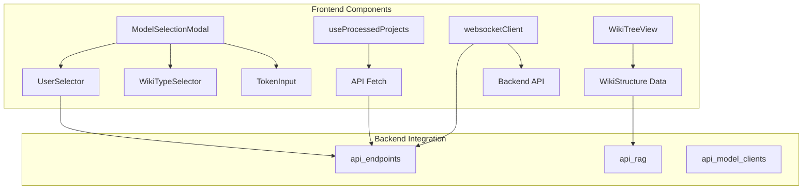
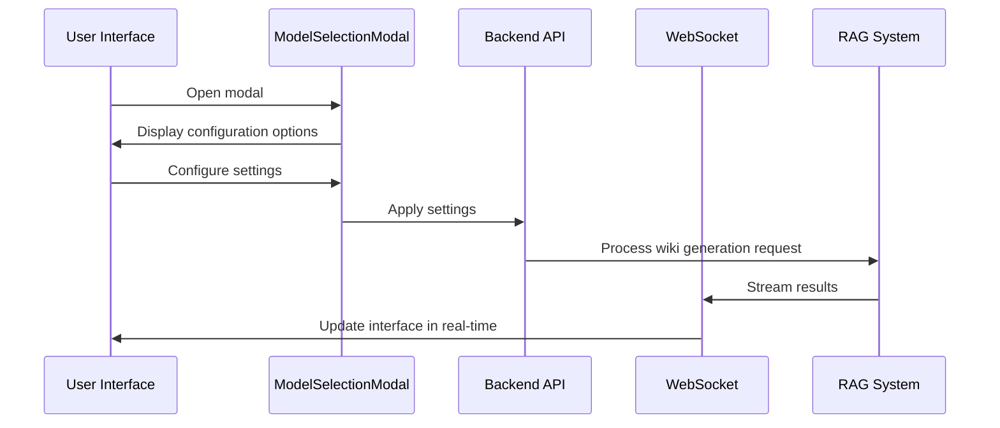
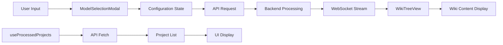

# Frontend Components Module

## Overview

The frontend_components module provides the core user interface components and utilities for the DeepWiki application. This module handles user interactions, state management, and communication with backend services through WebSocket connections. The components are built using React and TypeScript with a focus on providing an intuitive user experience for wiki generation and exploration.

## Architecture

The frontend_components module consists of four main areas:

1. **UI Components** - Interactive elements for user input and content display
2. **State Management Hooks** - Custom React hooks for managing application state
3. **Communication Utilities** - WebSocket client for real-time communication
4. **Data Structures** - Type definitions for frontend data models



## Core Components

### ModelSelectionModal

The `ModelSelectionModal` component provides a comprehensive interface for users to configure their wiki generation preferences. It allows users to select AI models, set up authentication, and configure file filtering options.

#### Key Features:
- Model and provider selection
- Wiki type selection (comprehensive vs simple)
- File filtering configuration (include/exclude directories and files)
- Authentication code input
- Token input for repository access

#### Dependencies:
- `UserSelector` - Handles model and provider selection
- `WikiTypeSelector` - Manages wiki type selection
- `TokenInput` - Handles repository access tokens
- `LanguageContext` - Provides internationalization support

#### Interface:
```typescript
interface ModelSelectionModalProps {
  isOpen: boolean;
  onClose: () => void;
  provider: string;
  setProvider: (value: string) => void;
  model: string;
  setModel: (value: string) => void;
  isCustomModel: boolean;
  setIsCustomModel: (value: boolean) => void;
  customModel: string;
  setCustomModel: (value: string) => void;
  onApply: (token?: string) => void;
  isComprehensiveView: boolean;
  setIsComprehensiveView: (value: boolean) => void;
  // ... additional optional properties for file filtering and authentication
}
```

### WikiTreeView

The `WikiTreeView` component displays the hierarchical structure of the generated wiki, allowing users to navigate between different sections and pages. It provides a tree-like navigation interface with expandable/collapsible sections.

#### Key Features:
- Hierarchical navigation with expandable sections
- Visual indicators for content importance
- Current page highlighting
- Fallback to flat list view when structure is not available

#### Data Structure:
The component works with the following data structure:

```typescript
interface WikiStructure {
  id: string;
  title: string;
  description: string;
  pages: WikiPage[];
  sections: WikiSection[];
  rootSections: string[];
}

interface WikiPage {
  id: string;
  title: string;
  content: string;
  filePaths: string[];
  importance: 'high' | 'medium' | 'low';
  relatedPages: string[];
  parentId?: string;
  isSection?: boolean;
  children?: string[];
}

interface WikiSection {
  id: string;
  title: string;
  pages: string[];
  subsections?: string[];
}
```

#### Interface:
```typescript
interface WikiTreeViewProps {
  wikiStructure: WikiStructure;
  currentPageId: string | undefined;
  onPageSelect: (pageId: string) => void;
  messages?: {
    pages?: string;
    [key: string]: string | undefined;
  };
}
```

### useProcessedProjects Hook

The `useProcessedProjects` custom hook manages the state and fetching of processed projects from the backend API. It provides a clean interface for components that need to display or interact with a list of available projects.

#### Key Features:
- Automatic fetching of processed projects
- Loading and error state management
- Type-safe data structure

#### Interface:
```typescript
interface ProcessedProject {
  id: string;
  owner: string;
  repo: string;
  name: string;
  repo_type: string;
  submittedAt: number;
  language: string;
}

function useProcessedProjects(): {
  projects: ProcessedProject[];
  isLoading: boolean;
  error: string | null;
}
```

#### Dependencies:
- [api_endpoints](api_endpoints.md) - Specifically the `/api/wiki/projects` endpoint

### websocketClient Utility

The `websocketClient` module provides a WebSocket-based communication layer for real-time chat completions and wiki generation. It replaces traditional HTTP streaming with WebSocket connections for better performance and reliability.

#### Key Features:
- WebSocket connection management
- Real-time message handling
- Error handling and connection management
- Type-safe request/response interfaces

#### Core Functions:

1. **createChatWebSocket** - Establishes a WebSocket connection for chat completions
2. **closeWebSocket** - Safely closes WebSocket connections

#### Interfaces:
```typescript
interface ChatMessage {
  role: 'user' | 'assistant' | 'system';
  content: string;
}

interface ChatCompletionRequest {
  repo_url: string;
  messages: ChatMessage[];
  filePath?: string;
  token?: string;
  type?: string;
  provider?: string;
  model?: string;
  language?: string;
  excluded_dirs?: string;
  excluded_files?: string;
}
```

## Component Interactions



## Data Flow



## Integration with Other Modules

### Backend Integration
- **[api_endpoints](api_endpoints.md)**: The frontend components communicate with backend endpoints for project data, wiki generation, and chat completions
- **[api_rag](api_rag.md)**: Wiki structure data is generated by the RAG system and consumed by the WikiTreeView component
- **[api_model_clients](api_model_clients.md)**: Model selection in the frontend maps to the available model clients in the backend

### Frontend Integration
- **Language Context**: Internationalization support through the LanguageContext
- **State Management**: Components use React hooks for local state management
- **UI Framework**: Components follow consistent styling using CSS variables

## Usage Patterns

### Model Selection Workflow
1. User opens the ModelSelectionModal
2. Configures model, provider, and wiki type preferences
3. Sets up authentication if required
4. Applies settings to initiate wiki generation

### Wiki Navigation
1. Wiki structure is loaded from backend
2. WikiTreeView renders hierarchical navigation
3. User selects pages to view content
4. Content is displayed with proper formatting

### Real-time Communication
1. WebSocket connection is established
2. Chat messages are sent to backend
3. Real-time responses are received and displayed
4. Connection is properly closed when finished

## Error Handling

The frontend components implement comprehensive error handling:

- **Network Errors**: Graceful handling of API failures
- **Authentication Errors**: Clear feedback for authentication issues
- **WebSocket Errors**: Connection recovery mechanisms
- **Validation Errors**: Input validation with user-friendly messages

## Performance Considerations

- **Lazy Loading**: Wiki sections are expanded on-demand
- **WebSocket Efficiency**: Real-time communication reduces latency
- **State Optimization**: Efficient state management prevents unnecessary re-renders
- **Memory Management**: Proper cleanup of WebSocket connections and event listeners

## Internationalization

All components support internationalization through the LanguageContext, allowing for multi-language support in the user interface.

## Security Considerations

- **Token Handling**: Secure handling of authentication tokens
- **Input Validation**: Client-side validation of user inputs
- **Connection Security**: WebSocket connections use secure protocols when available
- **Data Sanitization**: Content is properly sanitized before display