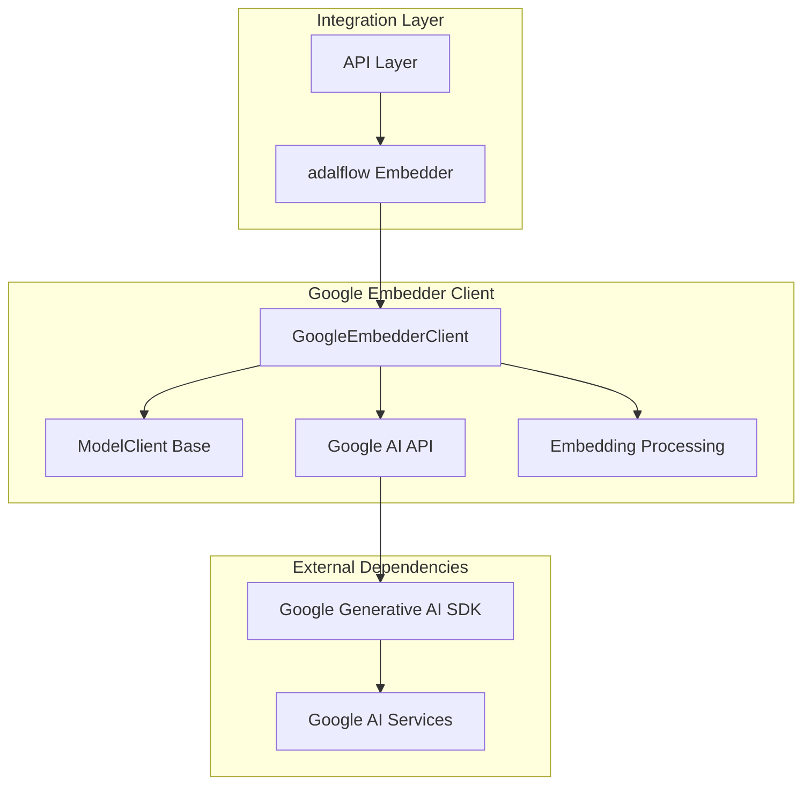
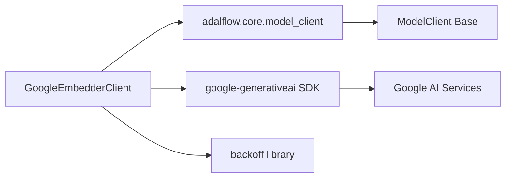
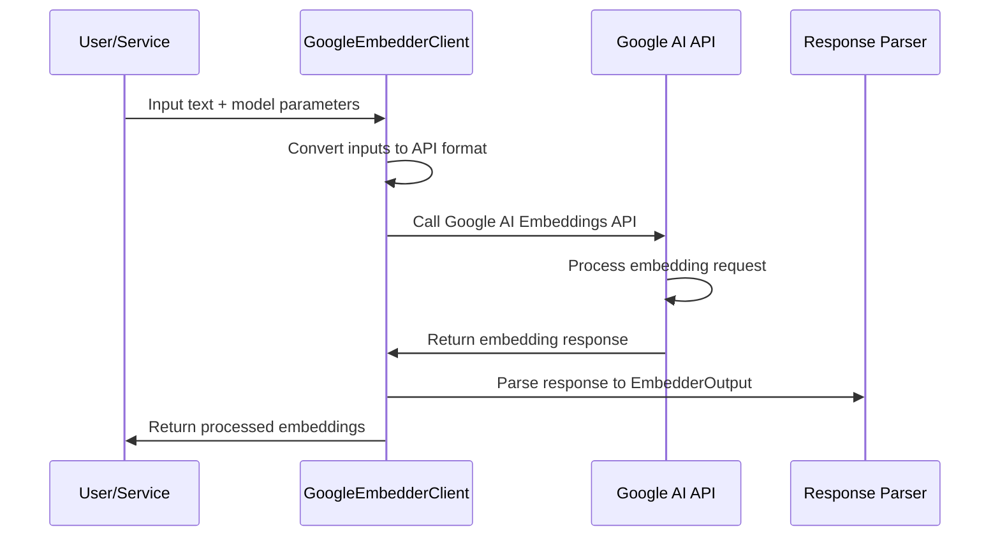
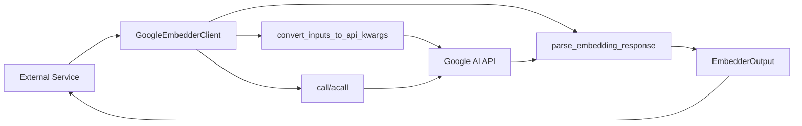
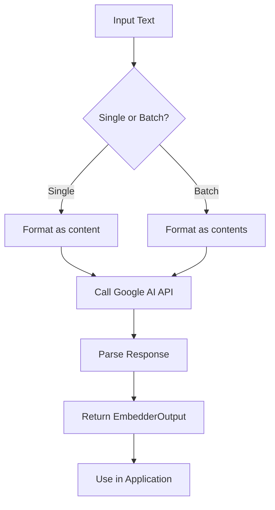

# Google Embedder Client Module

The Google Embedder Client module provides integration with Google's AI Embeddings API, enabling semantic similarity, retrieval, and classification tasks through Google's embedding models. This module is part of the broader [api_model_clients](api_model_clients.md) system that handles various AI model integrations.

## Overview

The Google Embedder Client serves as a wrapper around Google's AI Embeddings API, providing a standardized interface for embedding text content. It supports both single and batch embedding operations and integrates seamlessly with the adalflow framework for embedding operations.

## Architecture



## Core Components

### GoogleEmbedderClient

The primary component of this module is the `GoogleEmbedderClient` class, which extends the `ModelClient` base class. This client handles:

- API key management and client initialization
- Input conversion to Google AI API format
- Embedding API calls with retry logic
- Response parsing to standard embedding format
- Error handling and logging

## Dependencies



## Data Flow



## Component Interactions



## Key Features

### API Key Management
- Supports both explicit API key and environment variable configuration
- Default environment variable: `GOOGLE_API_KEY`
- Automatic client initialization

### Input Processing
- Handles both single string and sequence of strings
- Converts inputs to Google AI API format
- Supports both single and batch embedding operations

### Response Handling
- Comprehensive response parsing with fallback mechanisms
- Error handling and logging
- Standardized `EmbedderOutput` format

### Retry Logic
- Implements exponential backoff for API calls
- Handles various Google AI API exceptions
- Configurable retry parameters

## Usage Example

```python
from api.google_embedder_client import GoogleEmbedderClient
import adalflow as adal

client = GoogleEmbedderClient()
embedder = adal.Embedder(
    model_client=client,
    model_kwargs={
        "model": "text-embedding-004",
        "task_type": "SEMANTIC_SIMILARITY"
    }
)
```

## Integration Points

This module integrates with:
- [api_model_clients](api_model_clients.md) for standardized model client interfaces
- [api.rag](api_rag.md) for retrieval-augmented generation capabilities
- The adalflow framework for embedding operations

## Error Handling

The client implements comprehensive error handling including:
- API key validation
- Input type validation
- Response parsing errors
- Google AI API exceptions
- Logging for debugging and monitoring

## Configuration

The client can be configured with:
- Custom API key
- Custom environment variable name for API key
- Model-specific parameters through `model_kwargs`
- Task types for different embedding scenarios

## Process Flow



## Security Considerations

- API keys are handled securely through environment variables
- Input content is sanitized in logs
- Proper error handling prevents sensitive information exposure
- Follows Google AI API security best practices

## Performance Considerations

- Batch embedding support for efficiency
- Retry logic with exponential backoff
- Asynchronous call support (synchronous fallback)
- Memory-efficient response processing