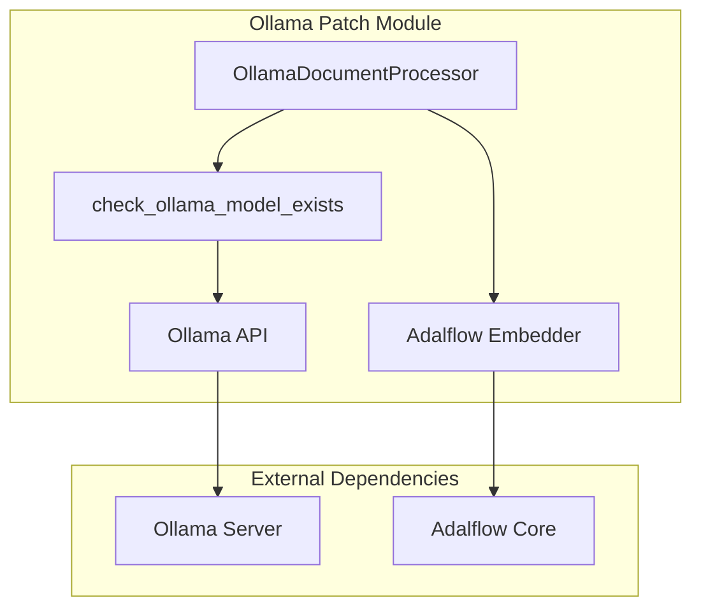
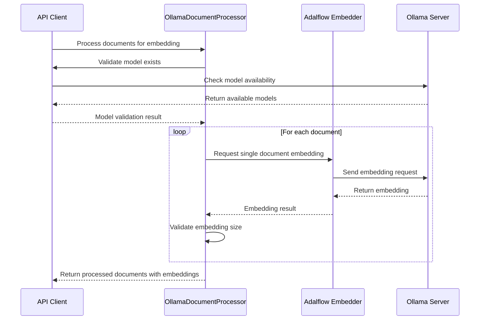

# Ollama Patch Module Documentation

## Overview

The `ollama_patch` module provides specialized functionality for working with Ollama models, particularly addressing the limitation that Adalflow's Ollama client does not support batch embeddings. This module includes utilities for checking model availability and processing documents individually for Ollama embeddings.

## Architecture



## Core Components

### OllamaDocumentProcessor

The `OllamaDocumentProcessor` is a `DataComponent` that processes documents individually for Ollama embeddings, since Adalflow's Ollama client doesn't support batch processing.

**Key Features:**
- Processes documents one at a time to work around batch embedding limitations
- Validates embedding size consistency across documents
- Implements error handling and logging for failed document processing
- Returns only successfully processed documents

**Methods:**
- `__init__(embedder)`: Initializes with an Adalflow embedder instance
- `__call__(documents)`: Processes a sequence of documents and returns embedded documents

### Utility Functions

#### check_ollama_model_exists
Verifies if an Ollama model exists before attempting to use it.

**Parameters:**
- `model_name`: Name of the model to check
- `ollama_host`: Ollama host URL (defaults to localhost:11434)

**Returns:** Boolean indicating model availability

#### OllamaModelNotFoundError
Custom exception raised when an Ollama model is not found.

## Data Flow



## Dependencies

- **Adalflow Core**: Provides the embedder interface and document types
- **Requests**: Used for HTTP communication with Ollama API
- **api.logging_config**: Provides logging setup functionality
- **api.model_clients**: The module integrates with the broader model client ecosystem ([model_clients.md](api_model_clients.md))

## Integration with System

The `ollama_patch` module is part of the `api_model_clients` module family and specifically addresses Ollama-specific limitations within the Adalflow framework. It works in conjunction with:

- [api_data_pipeline.md](api_data_pipeline.md) for document processing workflows
- [api_rag.md](api_rag.md) for embedding integration in RAG systems
- Other model client implementations in the [api_model_clients.md](api_model_clients.md) module

## Error Handling

The module implements comprehensive error handling:

1. **Model Availability**: Checks if Ollama models exist before processing
2. **Document Processing**: Continues processing other documents if one fails
3. **Embedding Consistency**: Validates embedding dimensions match across documents
4. **Network Issues**: Handles connection problems with Ollama server

## Configuration

The module respects the `OLLAMA_HOST` environment variable for specifying the Ollama server location. If not set, it defaults to `http://localhost:11434`.

## Performance Considerations

Since Ollama embeddings must be processed individually (no batch support), this module processes documents sequentially, which may impact performance with large document sets. The progress is tracked using tqdm for user feedback.

## Usage Example

```python
from api.ollama_patch import OllamaDocumentProcessor, check_ollama_model_exists
import adalflow as adal

# Check if model exists
if check_ollama_model_exists("nomic-embed-text"):
    # Initialize embedder
    embedder = adal.Embedder(
        model="nomic-embed-text",
        model_type="embedding",
        api_key=None
    )
    
    # Process documents
    processor = OllamaDocumentProcessor(embedder)
    embedded_docs = processor(documents)
```