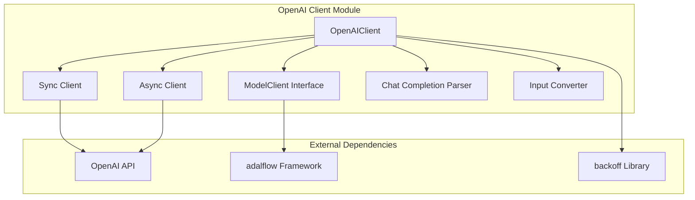
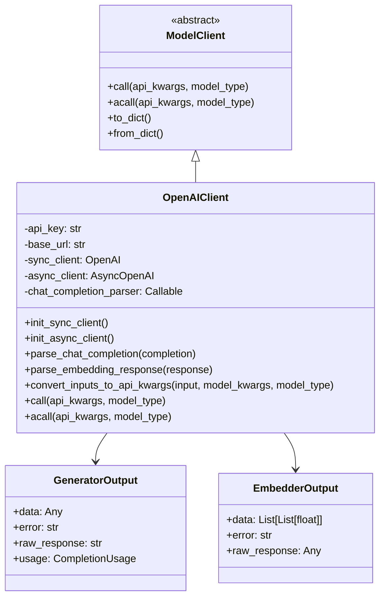
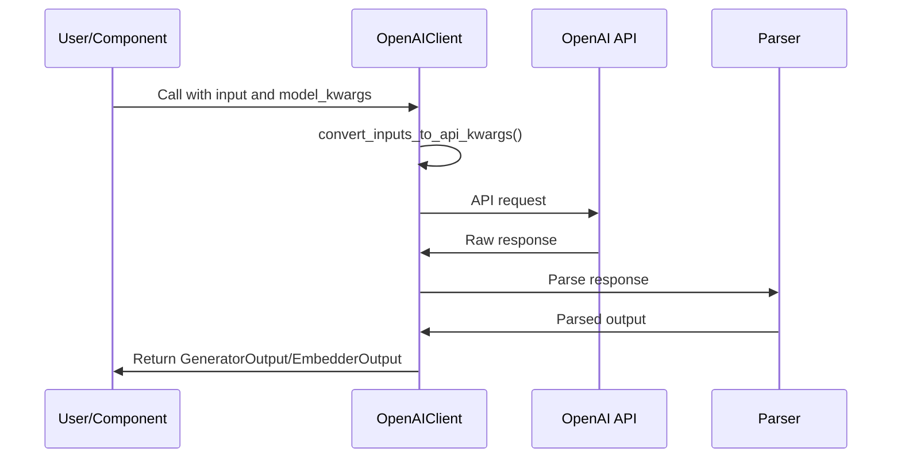

# OpenAI Client Module Documentation

## Overview

The `openai_client` module provides an integration layer for the OpenAI API within the system. It implements the `ModelClient` interface from the adalflow framework and supports various OpenAI services including chat completions, embeddings, and image generation. The module handles multimodal inputs, streaming responses, and includes robust error handling with exponential backoff.

## Architecture



## Core Components

### OpenAIClient

The main component of this module is the `OpenAIClient` class, which extends the `ModelClient` interface. It provides:

- **Chat Completion Support**: Handles text generation with streaming and non-streaming capabilities
- **Embedding Support**: Converts text to embeddings using OpenAI's embedding models
- **Image Generation**: Supports DALL-E models for image creation, editing, and variations
- **Multimodal Processing**: Handles text and image inputs together
- **Error Handling**: Implements exponential backoff for API reliability

#### Key Methods:
- `init_sync_client()`: Initializes the synchronous OpenAI client
- `init_async_client()`: Initializes the asynchronous OpenAI client (lazy loading)
- `convert_inputs_to_api_kwargs()`: Converts component inputs to API-specific format
- `parse_chat_completion()`: Parses chat completion responses
- `parse_embedding_response()`: Parses embedding responses
- `call()`: Synchronous API call with retry logic
- `acall()`: Asynchronous API call with retry logic
- `_prepare_image_content()`: Prepares image content for multimodal requests
- `_encode_image()`: Encodes local images to base64 for API requests
- `to_dict()`: Serializes the client to a dictionary (excludes unserializable objects)
- `from_dict()`: Creates a client instance from a dictionary (reinitializes clients)

#### Key Properties:
- `_api_key`: API key for authentication
- `base_url`: API endpoint URL
- `sync_client`: Synchronous OpenAI client instance
- `async_client`: Asynchronous OpenAI client instance (initialized on demand)
- `chat_completion_parser`: Function to parse chat completion responses
- `_input_type`: Input format ("text" or "messages")
- `_api_kwargs`: Stores API arguments for the current call

#### Usage Tracking:
- `track_completion_usage()`: Extracts token usage information from API responses
- Provides `CompletionUsage` with `completion_tokens`, `prompt_tokens`, and `total_tokens`

## Component Relationships



## Data Flow



## Key Features

### 1. Multimodal Support
The client supports multimodal inputs where images can be provided alongside text. Images can be provided as:
- Local file paths
- URLs
- Base64 encoded strings

### 2. Streaming and Non-Streaming Responses
- **Streaming**: Real-time response handling with `handle_streaming_response`
- **Non-Streaming**: Accumulated response processing for compatibility

### 3. Multiple Model Types
The client supports different model types:
- `ModelType.LLM`: Language model completions
- `ModelType.EMBEDDER`: Text embeddings
- `ModelType.IMAGE_GENERATION`: Image creation and editing

### 4. Image Generation Operations
The client supports multiple image operations:
- **Image Generation**: Creates new images from text prompts using DALL-E models
- **Image Editing**: Modifies existing images with a mask and prompt
- **Image Variations**: Creates variations of existing images

For image operations, the client handles:
- Automatic image encoding to base64 for local files
- Proper parameter validation and default setting
- Response parsing for both URL and base64 formats

### 5. Error Handling
Uses exponential backoff for handling common API errors:
- `APITimeoutError`
- `InternalServerError`
- `RateLimitError`
- `UnprocessableEntityError`
- `BadRequestError`

### 6. Input Conversion and Parsing
The module includes several utility functions for processing responses:

#### Parsing Functions:
- `get_first_message_content()`: Extracts content from the first message (default parser)
- `get_all_messages_content()`: Extracts content from all messages when n > 1
- `get_probabilities()`: Extracts token log probabilities from completion
- `parse_stream_response()`: Parses individual stream chunks
- `handle_streaming_response()`: Generator function to handle streaming responses
- `parse_embedding_response()`: Converts OpenAI embedding responses to adalflow format
- `parse_image_generation_response()`: Parses image generation responses

#### Input Conversion:
The `convert_inputs_to_api_kwargs()` method handles different input types:
- For `ModelType.EMBEDDER`: Converts input to sequence format
- For `ModelType.LLM`: Converts input to message format with optional system prompts
- For `ModelType.IMAGE_GENERATION`: Extracts prompt and sets default parameters

### 7. System Prompt Handling
The client supports system prompts using special tags:
- `<START_OF_SYSTEM_PROMPT>` and `<END_OF_SYSTEM_PROMPT>` for system messages
- `<START_OF_USER_PROMPT>` and `<END_OF_USER_PROMPT>` for user messages

## Usage Examples

### Basic Chat Completion
```python
from adalflow.core import Generator
from api.openai_client import OpenAIClient

gen = Generator(
    model_client=OpenAIClient(),
    model_kwargs={"model": "gpt-4o", "stream": False},
)
response = gen({"input_str": "What is the meaning of life?"})
```

### Multimodal Input with Images
```python
# Using local image file
response = gen({
    "input_str": "Describe this image",
    "images": "/path/to/image.jpg"
}, model_kwargs={"model": "gpt-4o", "detail": "high"})
```

### Image Generation
```python
from adalflow.core.types import ModelType

client = OpenAIClient()
api_kwargs = {
    "prompt": "A cute cat playing with a ball",
    "model": "dall-e-3",
    "size": "1024x1024",
    "n": 1
}
images = client.call(api_kwargs, ModelType.IMAGE_GENERATION)
```

## Dependencies

This module depends on:
- [model_client](model_client.md) - Core model client interface
- [adalflow](adalflow.md) - Core framework for AI components
- OpenAI Python library
- backoff library for retry mechanisms

## Integration Points

The `openai_client` module integrates with:
- [api_model_clients](api_model_clients.md) - Higher-level model client management
- [api_endpoints](api_endpoints.md) - API endpoints that may use OpenAI services
- [api_data_pipeline](api_data_pipeline.md) - For embedding operations in data processing

## Configuration

### Environment Variables
- `OPENAI_API_KEY`: Required API key for OpenAI services
- `OPENAI_BASE_URL`: Optional base URL for custom OpenAI-compatible endpoints

### Parameters
- `api_key`: Optional API key (defaults to environment variable)
- `base_url`: Custom API endpoint (defaults to OpenAI's official endpoint)
- `chat_completion_parser`: Custom function to parse chat completion responses
- `input_type`: Input format ("text" or "messages")

## Error Handling

The module implements robust error handling with:
- Exponential backoff for API retries
- Graceful degradation when parsing fails
- Detailed logging for debugging
- Proper error propagation to calling components

## Performance Considerations

- The async client is only initialized when needed
- Streaming responses are processed efficiently
- Token usage tracking is available for cost monitoring
- Image encoding is handled efficiently for multimodal inputs

## Security

- API keys are handled through environment variables
- No hardcoded credentials in the code
- Proper error handling prevents information leakage
- Input validation for all API parameters

## Testing

The module includes example usage code that demonstrates:
- Basic functionality
- Dictionary serialization/deserialization
- Integration with the adalflow Generator component