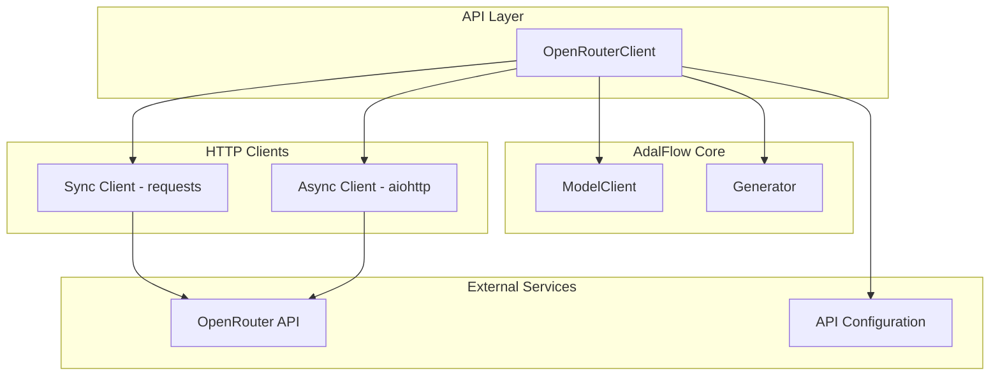
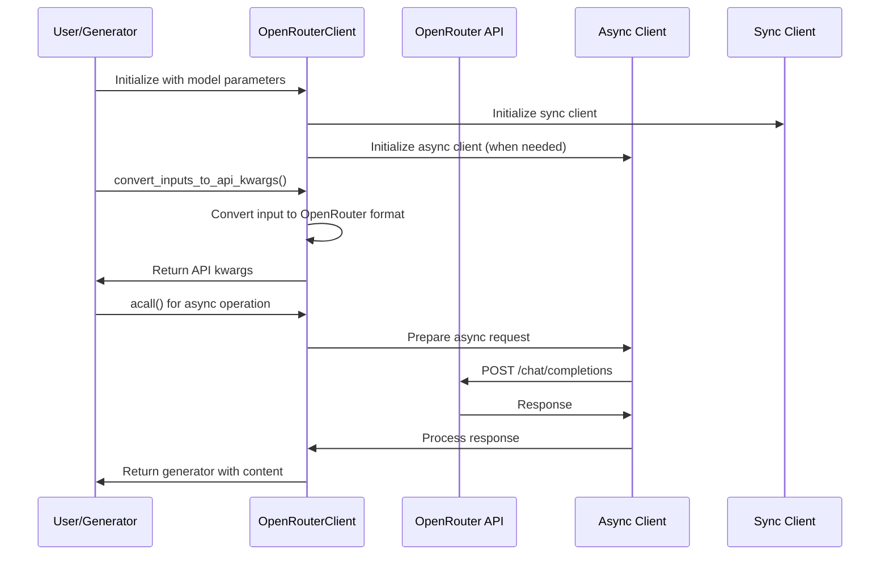
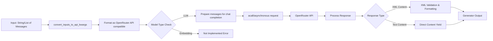

# OpenRouter Client Module Documentation

## Overview

The OpenRouter Client module provides integration with the OpenRouter API, which offers a unified interface to access hundreds of AI models through a single endpoint. This module implements the `ModelClient` interface from AdalFlow and provides both synchronous and asynchronous capabilities for interacting with OpenRouter's API.

The OpenRouter API is compatible with OpenAI's API format with minor differences, making it a versatile choice for accessing various AI models without changing the integration code significantly.

## Architecture



## Core Components

### OpenRouterClient

The main component of this module is the `OpenRouterClient` class, which extends `ModelClient` from AdalFlow. It provides the following key functionalities:

- **Synchronous and Asynchronous Support**: Maintains separate clients for sync and async operations
- **Input Conversion**: Converts AdalFlow inputs to OpenRouter API format
- **API Communication**: Handles communication with OpenRouter's API endpoints
- **Response Processing**: Processes both streaming and non-streaming responses
- **Error Handling**: Comprehensive error handling with generators for error messages

## Dependencies

This module depends on several external libraries and system components:

- **adalflow**: Core framework providing the `ModelClient` interface
- **aiohttp**: For asynchronous HTTP requests
- **requests**: For synchronous HTTP requests
- **api.config**: Contains the `OPENROUTER_API_KEY` configuration
- **logging**: For logging operations and debugging

For more information about the AdalFlow framework, see [model_clients](api_model_clients.md).

## Component Interactions



## Data Flow



## Key Features

### 1. Dual Client Architecture
The client maintains both synchronous and asynchronous HTTP clients:
- **Sync Client**: Uses `requests` library for synchronous operations
- **Async Client**: Uses `aiohttp` library for asynchronous operations (initialized on-demand)

### 2. Input Conversion
The `convert_inputs_to_api_kwargs` method handles conversion of various input formats:
- String inputs are converted to user message format
- List of message dictionaries are passed through
- Model-specific parameters are preserved

### 3. XML Response Processing
Special handling for XML responses, particularly for wiki_structure content:
- Validates and formats XML content
- Handles common XML parsing issues
- Rebuilds clean XML structure when validation fails

### 4. Comprehensive Error Handling
- API key validation with graceful error messages
- Connection error handling
- Response format validation
- Generator-based error reporting for streaming responses

## Usage Example

```python
from api.openrouter_client import OpenRouterClient

client = OpenRouterClient()
generator = adal.Generator(
    model_client=client,
    model_kwargs={"model": "openai/gpt-4o"}
)
```

## Integration Points

This module integrates with:
- [api_model_clients](api_model_clients.md) - As part of the model client ecosystem
- [api.config](api_config.md) - For API key configuration
- [api.rag](api_rag.md) - Through the Generator component for RAG operations

## Error Handling

The module implements robust error handling through generator-based responses:
- API key not configured → Error generator with descriptive message
- Connection errors → Connection error generator
- Unexpected API responses → Format error generators
- Model type not supported → Model type error generator

## Configuration

The module requires the `OPENROUTER_API_KEY` to be configured in the system's configuration. Without this key, the client will log warnings and return error generators instead of making API calls.

## Limitations

- **Embedding Support**: Currently not implemented (raises NotImplementedError)
- **Streaming**: Always uses non-streaming mode for OpenRouter API calls
- **Model Type Restriction**: Only supports LLM model type currently

## Performance Considerations

- Async client is initialized only when needed to conserve resources
- Uses 60-second timeout for API calls to prevent hanging requests
- Implements proper buffer management for streaming responses
- XML processing includes fallback mechanisms to handle malformed content