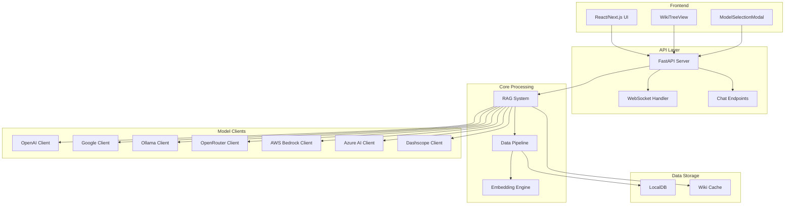
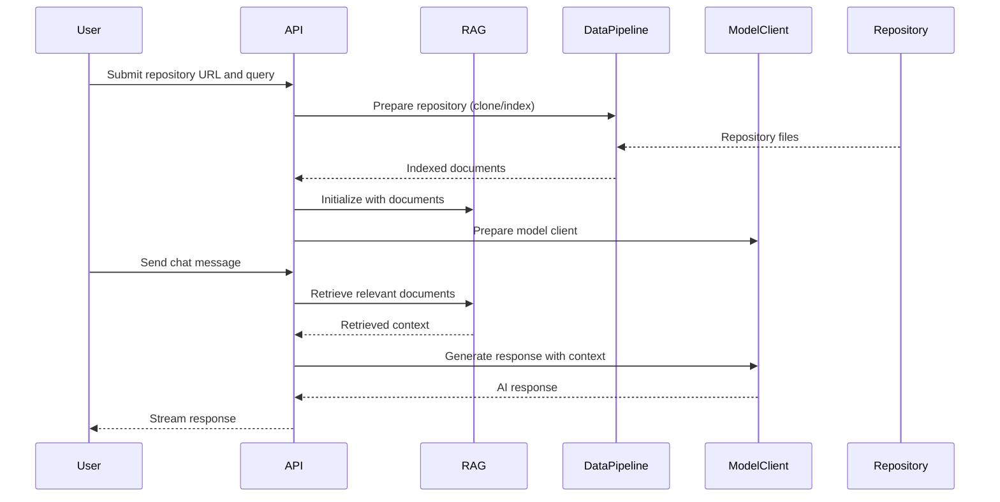

# DeepWiki-Open Documentation

DeepWiki-Open is an advanced repository analysis and documentation generation system that leverages AI models to create comprehensive wikis from code repositories. The system supports multiple AI providers, offers RAG (Retrieval-Augmented Generation) capabilities, and provides both HTTP and WebSocket-based chat interfaces.

## Architecture Overview

## Core Components

### API Layer
- **api/api.py**: Main FastAPI application with endpoints for wiki generation, model configuration, and project management
- **api/simple_chat.py**: HTTP streaming chat completions endpoint
- **api/websocket_wiki.py**: WebSocket-based chat completions for real-time interaction
- **api/rag.py**: Core RAG implementation with memory management and document retrieval

### Data Processing
- **api/data_pipeline.py**: Repository cloning, document reading, text splitting, and embedding pipeline
- **api/tools/embedder.py**: Embedder factory and configuration management

### Model Clients
- **api/openai_client.py**: OpenAI API integration with multimodal support
- **api/azureai_client.py**: Azure OpenAI API integration
- **api/openrouter_client.py**: OpenRouter API integration
- **api/bedrock_client.py**: AWS Bedrock API integration
- **api/dashscope_client.py**: Alibaba Cloud Dashscope API integration
- **api/google_embedder_client.py**: Google AI Embeddings integration
- **api/ollama_patch.py**: Ollama-specific embedding processing

### Frontend Components
- **src/components/ModelSelectionModal.tsx**: Model and provider selection UI
- **src/components/WikiTreeView.tsx**: Hierarchical wiki navigation component
- **src/hooks/useProcessedProjects.ts**: Hook for managing processed projects
- **src/utils/websocketClient.ts**: WebSocket client for real-time chat

## Key Features

### Multi-Provider AI Support
The system supports multiple AI providers through a unified interface:
- OpenAI (GPT models)
- Google (Gemini models)
- Ollama (local models)
- OpenRouter (hundreds of models)
- AWS Bedrock (Anthropic Claude, Amazon Titan)
- Azure OpenAI
- Alibaba Cloud Dashscope

### RAG Implementation
The RAG (Retrieval-Augmented Generation) system provides:
- Document retrieval from code repositories
- Conversation memory management
- Context-aware responses
- File-specific content retrieval

### Real-time Chat Interface
- WebSocket-based streaming responses
- HTTP streaming fallback
- Multi-turn conversation support
- Deep research mode for detailed analysis

### Repository Analysis
- Multi-platform support (GitHub, GitLab, Bitbucket)
- Custom file filtering (include/exclude directories/files)
- Token-aware processing to handle large repositories
- Local caching for improved performance

## Configuration

The system is configured through environment variables and configuration files:

- **Model Configuration**: Providers, models, and API keys
- **Embedding Configuration**: Embedder types and parameters
- **File Filters**: Default excluded directories and files
- **Authentication**: Wiki access control and repository tokens

## Data Flow

## Sub-Module Documentation

For detailed information about specific components, see:
- [RAG System](api_rag.md)
- [Data Pipeline](api_data_pipeline.md)
- [Model Clients](api_model_clients.md)
- [API Endpoints](api_endpoints.md)
- [Frontend Components](frontend_components.md)